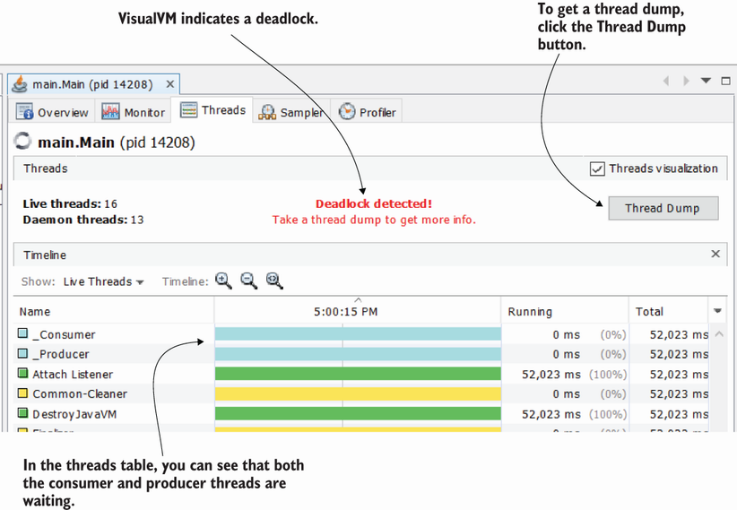
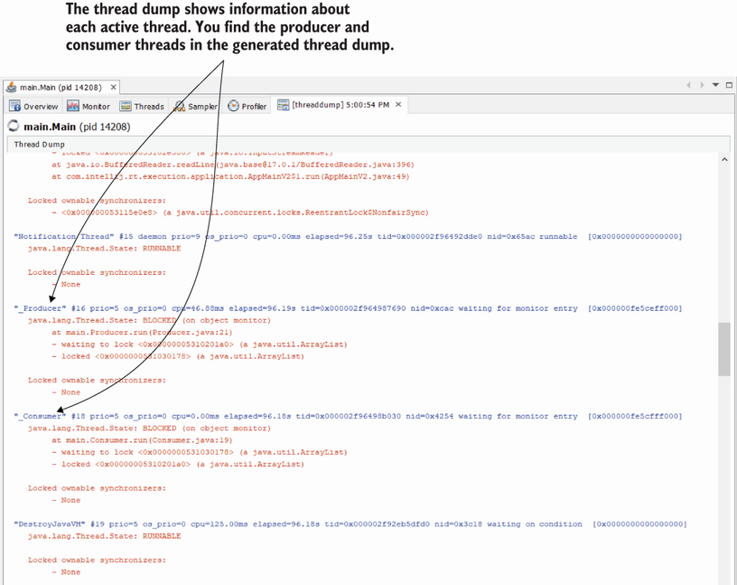
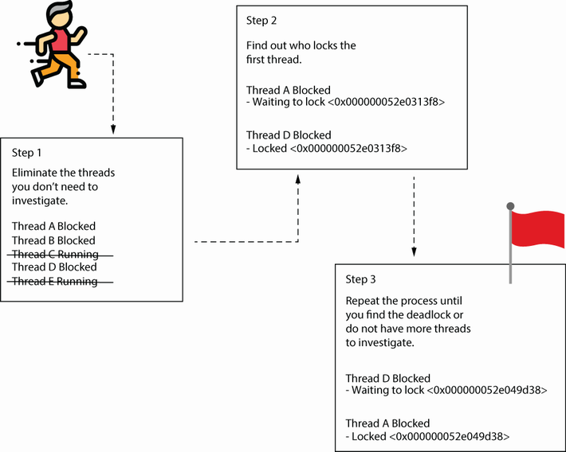
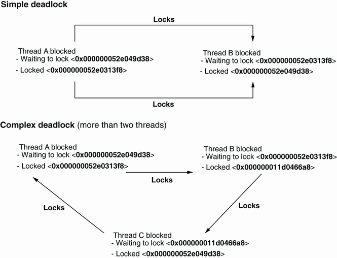
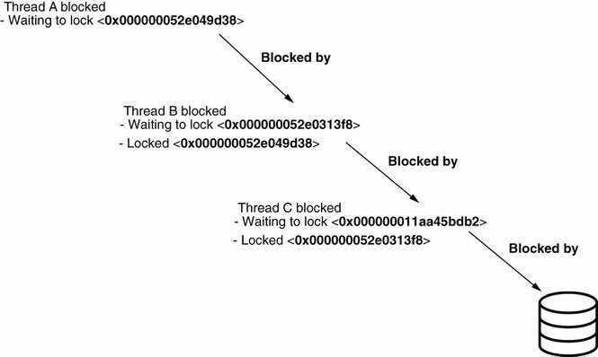

# 10.1.1 Getting a thread dump using a profiler

https://visualvm.github.io/download.html

What do we do when we have a frozen app and we want to identify the problem’s root cause? Using a profiler to analyze the locks most likely won’t work in a scenario in which the app, or part of it, is frozen. Instead of analyzing the locks during execution, as we did in chapter 9, we’ll take a snapshot just of the app’s thread states. We’ll read this snapshot (i.e., thread dump) and find out which threads are affecting each other and causing the app to freeze.

You can obtain a thread dump either by using a profiler tool (e.g., VisualVM, JProfiler) or by directly calling a tool provided by the JDK using the command line. In this section, we’ll discuss how to obtain a thread dump using a profiler, and in section 10.1.2, we’ll learn how to get the same information using the command line.

We’ll start our application (project da-ch10-ex1) and wait a few seconds for it to enter a deadlock. You’ll know the app gets into a deadlock when it no longer writes messages in the console (it gets stuck).


To start the project, follow these steps:

* Start project da-ch10-ex1.
    ```
    mvn clean package
    java -XX:+HeapDumpOnOutOfMemoryError -XX:HeapDumpPath=heapdump.bin  -cp .\target\da-ch10-ex1-1.0-SNAPSHOT.jar  main.Main
    ```
* Start VisualVM.
    ```
    D:\userData\robert_desktop\visualvm_215\bin>visualvm  --jdkhome  "D:\DATA\JAVA\old_jdks\jdk8u362-b09"
    ```
* Select a process for project da-ch10-ex1 in VisualVM.
* Go to the Threads tab in VisualVM.

Getting the thread dump using a profiler is a simple approach. It’s no more than the click of a button. Let’s use VisualVM to get a thread dump. Figure 10.2 shows the Visual VM interface. You can see that VisualVM is smart and figured out that some of the threads of our process ran into a deadlock. This is indicated in the Threads tab.


###### Figure 10.2 When some of the app’s threads get into a deadlock, VisualVM indicates the situation with a message in the Threads tab. Notice that both the ``_Consumer`` and ``_Producer`` threads are locked on the graphic timeline. To get a thread dump, you simply select the Thread Dump button in the window’s upper-right corner.
 

After the thread dump is collected, the interface looks like figure 10.3. The thread dump is represented as plain text that describes the app threads and provides details about them (e.g., their state in the life cycle, who blocks them, etc.).

**At first, you might not understand the thread dump text in figure 10.3. Later in this chapter, you’ll learn to read it.**


###### Figure 10.3 A thread dump in plain text that describes an app’s threads. In the thread dump we collected, we can find the two deadlocked threads ``_Consumer`` and ``_Producer``.
 

# 10.1.1 Getting a thread dump using a profiler

10.1.2 Generating a thread dump from the command line
A thread dump can also be obtained using the command line. This approach is particularly useful when you need to get a thread dump from a remote environment. Most of the time, you won’t be able to remote profile an app installed in an environment (and remember, remote profiling and remote debugging aren’t recommended in a production environment, as discussed in chapter 4). Since in most cases you can only access a remote environment using the command line, you need to know how to get a thread dump this way too.

Fortunately, getting a thread dump using the command line is quite easy :

* Find the process ID for which you want a thread dump.
  ```
  jps -l
  ```
* Get the thread dump as text data (raw data) and save it in a file.
  ```
    jstack <<PID>>    
    jstack <<PID>>   > PATH\stack_trace.tdump
  ```
* Load the saved thread dump to make it easier to read in a profiler tool.
  * For example, to open it in VisualVM, you select File > Load.
  * We’ll use a tool named fastThread (https://fastthread.io/), which provides a simpler way to visualize the data in a thread dump.

### 10.2.1 Reading plain-text thread dumps
If you suspect a deadlock, you should focus your investigation on the locks the threads cause (figure 10.8):

* Filter out all threads that are not blocked so that you can focus on the threads that can cause the deadlock.
* Start with the first candidate thread (a thread you didn’t filter in step 1), and search the lock ID that causes it to be blocked.
* Find the thread causing that lock, and check what blocks that thread. If at some point you return to the thread you started with, all the threads you parsed are in a deadlock.

###### Figure 10.8 To find a deadlock with a thread dump, follow these three easy steps. First, remove all threads that are not blocked. Then, start with one of the blocked threads and find what is blocking it using the lock ID. Continue this process for each thread. If you return to a thread you already investigated, it means you found a deadlock.
 

##### Step 1: Filter out threads that are not locked

First, filter out all the threads that are not locked so that you can focus only on the threads that are potential candidates for the situation you are investigating—the deadlock. A thread dump can describe dozens of threads. You want to eliminate the noise and focus only on the threads that are blocked.

##### Step 2: Take the first candidate thread and find what blocks it

After eliminating the unnecessary thread details, start with the first candidate thread and search by the lock ID that causes a thread to wait. The lock ID is the one between angle brackets (in listing 10.4, "``_Producer``" waits for a lock with ID ``0x000000052e0313f8``).

##### Step 3: Find what blocks the next thread

Repeat the process. If at some point you get to a thread that was already investigated, you’ve found a deadlock; please see the following listing.

Listing 10.4 Finding threads that lock each other
```shell
"_Producer" #16 prio=5 os_prio=0 cpu=46.88ms elapsed=763.96s tid=0x000002f964987690 nid=0xcac waiting for monitor entry  [0x000000fe5ceff000]
   java.lang.Thread.State: BLOCKED (on object monitor)
    at main.Producer.run(Unknown Source)
    - waiting to lock <0x000000052e0313f8>(a java.util.ArrayList)     
    - locked <0x000000052e049d38>(a java.util.ArrayList)     
 
"_Consumer" #18 prio=5 os_prio=0 cpu=0.00ms elapsed=763.96s tid=0x000002f96498b030 nid=0x4254 waiting for monitor entry  [0x000000fe5cfff000]
   java.lang.Thread.State: BLOCKED (on object monitor)
    at main.Consumer.run(Unknown Source)
    - waiting to lock <0x000000052e049d38> (a java.util.ArrayList)   ❶
    - locked <0x000000052e0313f8> (a java.util.ArrayList)            ❷
```    
❶ The _Consumer thread waits for a lock initiated by the _Producer thread.

❷ The _Producer thread waits for a lock initiated by the _Consumer thread.

Our example demonstrates a simple deadlock that assumes two threads lock each other. Following the three-step process discussed earlier, you’ll see that the "_Producer" thread blocks the "_Consumer" thread, and vice versa. A complex deadlock happens when more than two threads are involved. For example, thread A blocks thread B, thread B blocks thread C, and thread C blocks thread A. You can discover a long chain of threads that lock each other. The longer the chain of threads in the deadlock, the more difficult the deadlock is to find, understand, and solve. Figure 10.9 shows the difference between a complex deadlock and a simple one.

###### Figure 10.9 When only two threads block each other, it’s called a simple deadlock, but a deadlock can be caused by multiple threads that block each other. More threads means more complexity. Thus, when more than two threads are involved, it's called a complex deadlock.
 

Sometimes a complex deadlock can be confused with cascading blocked threads (figure 10.10). Cascading blocked threads (also known as cascading locks) are a different issue you can spot using a thread dump. To find cascading threads, follow the same steps as when investigating a deadlock. But instead of finding that one of the threads is blocked by another in the chain (as in the case of a deadlock), in a cascade of locks, you’ll see that one of the threads is waiting for an external event, causing all others to also wait.

###### Figure 10.10 Cascading locks appear when multiple threads enter a chain where they wait for one another. The last thread in the chain is blocked by an external event, such as reading from a data source or calling an endpoint.
 
Cascading blocked threads usually signal a bad design in the multithreaded architecture. When we design an app with multiple threads, we implement threading to allow the app to process things concurrently. Having threads waiting for one another defeats the purpose of a multithreaded architecture. Although sometimes you need to make threads wait for one another, you shouldn’t expect long chains of threads with cascading locks.

### 10.2.2 Using tools to better grasp thread dumps
https://fastthread.io/