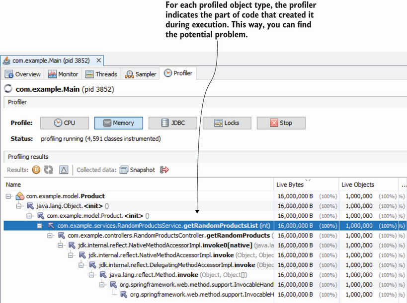

# 11.1 Sampling and profiling for memory issues

https://visualvm.github.io/download.html

In this section, we use a small application that simulates a faulty implemented capability that uses too much of the allocated memory. We use this app to discuss investigation techniques you can use to identify issues with memory allocation or places in code that can be optimized to use the system’s memory more efficiently.

Suppose you have a real application, and you notice that some feature runs slowly. You use the techniques we discussed in chapter 6 to analyze resource consumption and find that although the app doesn’t “work” very often (consume CPU resources), it uses a large amount of memory. When an app uses too much memory, the JVM can trigger the garbage collector (GC), which will further consume CPU resources also. Remember that the GC is the mechanism that automatically deallocates unneeded data from memory (see appendix E for a refresher).

Look at figure 11.1. When discussing how to analyze resource consumption in chapter 6, we used the Monitor tab in VisualVM to observe what resources the app consumes. You can use the memory widget in this tab to find when the app uses an extensive amount of memory.

###### Figure 11.1 The memory widget in the Monitor tab in VisualVM helps you to identify if the app spends more memory than usual at any given time. Often, widgets in the Monitor tab, such as CPU and memory consumption, give us clues on how to continue our investigation. When we see that the app consumes an abnormal amount of memory, we may decide to continue with memory profiling the execution.
  

The application we use in this chapter is in project ``da-ch11-ex1``. This small web application exposes an endpoint. When calling this endpoint, we give a number, and the endpoint creates that many object instances. We basically make a request to create one million objects (a large enough number for our experiment) and then look at what a profiler tells us about this request execution. This endpoint execution simulates what happens in a real-world situation when a given app capability spends a lot of the app’s memory resources (figure 11.2).

###### Figure 11.2 When we call the endpoint exposed by the provided project ``da-ch11-ex1``, the app creates a large number of instances that consume a considerable part of the app’s memory. We’ll analyze this scenario using a profiler.
 

To start the project, follow these steps:

* Start project ``da-ch11-ex1``.
    ```
    mvn clean package
    java -jar target/da-ch11-ex1-1.0-SNAPSHOT.jar
    ```
* Start VisualVM.
    ```
    D:\userData\robert_desktop\visualvm_215\bin>visualvm  --jdkhome  "D:\DATA\JAVA\old_jdks\jdk8u362-b09"
    ```
* Select a process for project da-ch11-ex1 in VisualVM.
* Go to the Monitor tab in VisualVM.
* Call the ``/products/1000000`` endpoint.
* Observe the memory widget in the Memory tab in VisualVM

In the Monitor tab in the memory widget, you can see that the app uses a lot of memory resources. The widget looks similar to [figure 11.1](#figure-111-the-memory-widget-in-the-monitor-tab-in-visualvm-helps-you-to-identify-if-the-app-spends-more-memory-than-usual-at-any-given-time-often-widgets-in-the-monitor-tab-such-as-cpu-and-memory-consumption-give-us-clues-on-how-to-continue-our-investigation-when-we-see-that-the-app-consumes-an-abnormal-amount-of-memory-we-may-decide-to-continue-with-memory-profiling-the-execution). What should we do when we suspect some app capability doesn’t optimally use the memory resources? The investigation process follows two major steps:

* Use memory sampling to get details about the object instances the app stores.
* Use memory profiling (instrumentation) to get additional details about a specific part of the code in execution.

Let’s follow the same approach you learned in chapters 7 to 9 for CPU resource consumption: ``get a high-level view of what happens using sampling``. To sample an app execution for memory usage, select the Sampler tab in VisualVM. Then select the Memory button to start a memory usage sampling session. Call the endpoint and wait for the execution to end. The VisualVM screen will display the objects the app allocates.

We are looking for what occupies most of the memory. In most cases, that will be one of these two situations:

* Many object instances of certain types are created and fill up the memory (this is what happens in our scenario).
* There are not many instances of a certain type, but each instance is very large.

Many instances filling up the allocated memory makes sense, but how could a small number of instances do this? Imagine this scenario: your app processes large video files. The app loads maybe two or three files at a time, but since they are large, they fill the allocated memory. A developer can analyze whether the capability can be optimized. Maybe the app doesn’t need the full files loaded in memory but just fragments of them at a time.

When we start our investigation, we don’t know which scenario we’ll fall into. I usually sort, in descending order, by the amount of memory occupied and then by the number of instances. Notice in figure 11.3 that VisualVM shows you the memory spent and the number of instances for each sampled type. You need to sort, in descending order, by the second and the third columns in the table.

In figure 11.3, you clearly see that I sorted the table in descending order by Live Bytes (space occupied). We can then look for the first type in our app’s codebase that appears in the table. Don’t look for primitives, strings, arrays of primitives, or arrays of strings. These are usually at the top since they are created as a side effect. However, in most cases, they don’t provide any clues about the problem.


###### Figure 11.3 We sort the sampled results in descending order by memory occupied. This way, we can see which objects consume most of the memory. We don’t usually look for primitives, strings, and arrays of strings or JDK objects in general. We are mostly interested in finding the object, directly related to our codebase, that is causing the problem. In this case, the Product type (which is part of our codebase) occupies a large part of the memory.
 

In figure 11.3, we clearly see that type ``Product`` is causing trouble. It occupies a large part of the allocated memory, and in the Live Objects column, we see that the app created one million instances of this type.`

**The profiling tool names them Live Objects because sampling only shows you the instances that still exist in the memory.**

If you need the total number of instances of the type created throughout execution, you must use profiling (instrumentation) techniques. We’ll do this later in this chapter.

This app is just an example, but in a real-world app, simply sorting by the occupied space may not be enough. We need to figure out whether the problem is a large number of instances or whether each instance takes a lot of space. I know what you’re thinking: isn’t it clear in this case? Yes, but in a real-world app it may not be, so I always recommend that developers also sort in descending order by the number of instances to make sure. Figure 11.4 shows the sampled data sorted in descending order by the number of instances the app created for each type. Again, type ``Product`` is at the top.

###### Figure 11.4 We can sort the sampled results by the number of instances (live objects). This gives us clues on whether some capability creates a large number of objects that are negatively affecting the memory allocation.
 

Sometimes sampling is enough to help you identify the problem. But what if you can’t figure out what part of the app creates these objects? When you can’t find the problem just by sampling the execution, your next step is profiling (instrumentation). Profiling gives you more details, including what part of the code created the potentially problematic instances. But remember the rule of thumb: when you use profiling, you need to first know what to profile. That’s why we always begin by sampling.

Since we know the problem is with the ``Product`` type, we will profile for it. Like you did in chapters 7 to 9, you must specify which part of the app you want to profile using an expression. In figure 11.5, I profile only for the ``Product`` type. I do this by using the fully qualified name (package and class name) of the class in the Memory settings textbox on the right side of the window.

###### Figure 11.5 To profile for memory allocation, first specify which packages or classes you want to profile, and then start the profiling by pressing the Memory button. The profiler will give you relevant details about the profile types, including used memory, number of instances, the total number of allocated objects, and the number of GC generations.
 

Just as in the case of CPU profiling (chapter 8), you can profile for more types at a time or even specify entire packages. Some of the most commonly used expressions are as follows:

* **Strict-type, fully qualified name** (e.g., ``com.example.model.Product``)—Only searches for that specific type

* **Types in a given package** (e.g., ``com.example.model.*``)—Only searches for types declared in the package com.example.model but not in its subpackages

* **Types in a given package and its subpackages** (e.g., ``com.example.**``)—Searches in the given package and all its subpackages


**Always remember to restrict the types you profile as much as possible. If you know Product causes the problem, then it makes sense to profile only this type.**


In addition to the live objects (which are the instances that still exist in memory for that type), you will get the total number of instances of that type that the app created. Moreover, you will see how many times those instances “survived” the GC (what we call generations).

These details are valuable, but finding what part of the code creates the objects is often even more useful. As shown in figure 11.6, for each profiled type, the tool displays where the instances were created. Click the plus sign (+) on the left side of the line in the table. This capability quickly shows you the root cause of the problem.


###### Figure 11.6 The profiler shows the stack trace of the code that created the instances of each of the profiled types. This way, you can easily identify what part of the app created the problematic instances.
 
