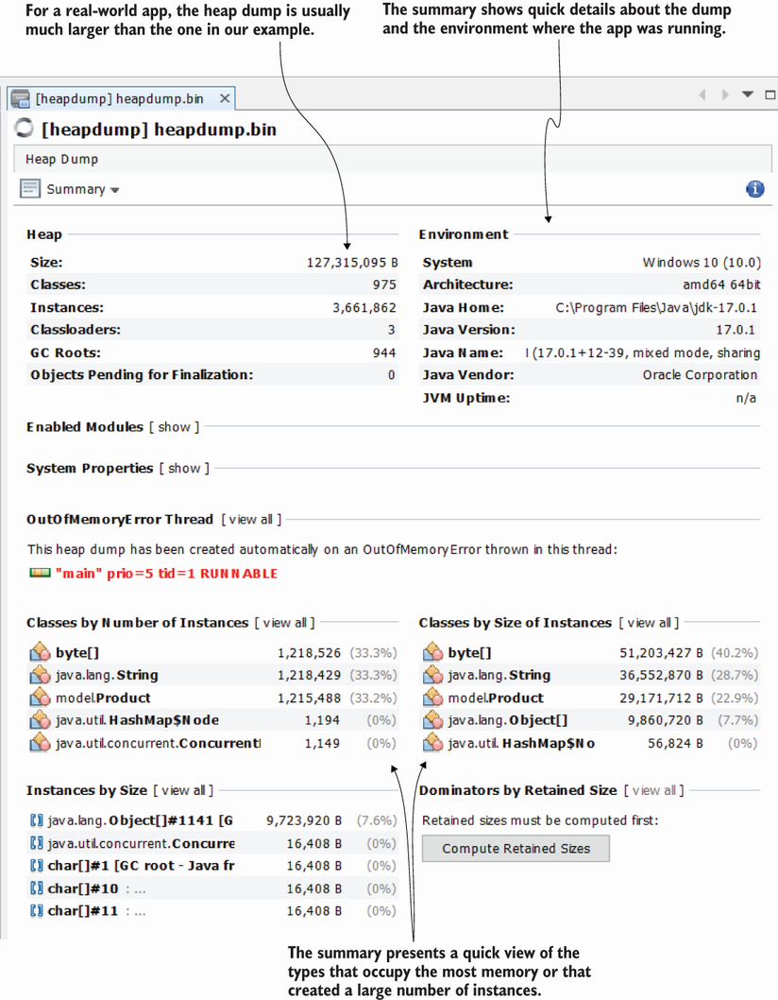

# 11.2 Using heap dumps to find memory leaks

https://visualvm.github.io/download.html

If the app is running, you can profile to identify any capability that can be optimized. But what if the app crashed and you suspect this happened due to a memory allocation issue? In most cases, app crashes are caused by capabilities with memory allocation problems such as memory leaks—the app doesn’t deallocate the objects it creates in memory even after it doesn’t need them. Since the memory is not infinite, continuously allocating objects will fill the memory at some point, causing the app to crash. In a JVM app, this is signaled with an ``OutOfMemoryError`` thrown at run time.

If the app is not running, you can’t attach a profiler to investigate the execution. But, even so, you have other alternatives to investigate the problem. You can use a heap dump, which is a snapshot of what the heap memory looked like when the app crashed. Although you can collect a heap dump anytime, it is most useful when you can’t profile the app for some reason—maybe because the app crashed or you simply don’t have access to profile the process and you want to determine whether it suffers from any memory allocation issues.

In the next section, we’ll discuss three possible ways to get a heap dump, and in section 11.2.2, I’ll show you how to use the heap dump to identify memory allocation issues and their root causes. In section 11.2.3, we’ll discuss a more advanced way of reading a heap dump using a query language called Object Query Language (OQL). OQL is similar to SQL, but instead of querying a database, you use OQL to query the data in a heap dump.
## 11.2.1 Obtaining a heap dump
In this section, we’ll discuss three ways to generate a heap dump:

* Configure the application to generate one automatically in a given location when the app crashes because of a memory issue.
* Use a profiling tool (such as VisualVM).
* Use a command-line tool (such as ``jcmd`` or ``jmap``).

You can even get a heap dump programmatically. Some frameworks have capabilities that can generate a heap dump, which allow developers to integrate app-monitoring tools. To learn more about this subject, see the ``HotSpotDiagnosticMXBean`` class in the Java official API documentation (http://mng.bz/19XZ).

Project da-ch11-ex1 implements an endpoint you can use to generate the heap dump using the ``HotSpotDiagnosticMXBean`` class. Calling this endpoint using cURL or Postman will create a dump file:

```
curl http://localhost:8080/jmx/heapDump?file=dump.hprof
```

## Configuring an app to generate a heap dump when it encounters a memory issue
Developers often use a heap dump to investigate an app crash when they suspect faulty memory allocation is causing a problem. For this reason, apps are most often configured to generate a heap dump of what the memory looked like when the app crashed. You should always configure an app to generate a heap dump when it stops due to a memory allocation problem. Fortunately, the configuration is easy. 

You just need to add a couple of JVM arguments when the app starts:
```shell
-XX:+HeapDumpOnOutOfMemoryError    
-XX:HeapDumpPath=heapdump.bin 
```

The first argument, ``-XX:+HeapDumpOnOutOfMemoryError``, tells the app to generate a heap dump when it encounters an ``OutOfMemoryError`` (the heap gets full). The second argument, ``XX:HeapDumpPath=heapdump.bin``, specifies the path in the filesystem where the dump will be stored. In this case, the file containing the heap dump will be named heapdump.bin and will be located close to the executable app, from the root of the ``classpath`` (because we used a relative path). Make sure the process has “write” privileges on this path to be able to store the file in the given location.

The following snippet shows the full command for running an app:

```shell
java -XX:+HeapDumpOnOutOfMemoryError -XX:HeapDumpPath=heapdump.bin -Xmx100m  -cp target/da-ch11-ex2-1.0-SNAPSHOT.jar  main.Main
```

We’ll use a demo app named ``da-ch11-ex2`` to demonstrate this approach. You can find this app in the projects provided with the book. The app in the following listing continuously adds instances of type Product to a list until the memory fills.

###### Listing 11.1 Generating a large numbers of instances that can’t be 
```java
public class Main {
 
  private static List<Product> products = new ArrayList<>();
 
  public static void main(String[] args) {
    Random r = new Random();
    while (true) {                   ❶
      Product p = new Product();
      p.setName("Product " + r.nextInt());
      products.add(p);               ❷
    }
  }
} 
```
❶ The loop iterates forever.
❷ Adds instances to the list until the memory gets full

The next code snippet shows what the simple ``Product`` type looks like:
```java
public class Product {
 
  private String name;
 
  // Omitted getters and setters
 
}
```
Maybe you’re wondering why there is a random name for the product instances. We’ll need that later when we discuss reading a heap dump in section 11.2.2. For the moment, we’re only interested in how to generate a heap dump to figure out why this app is filling its heap memory in seconds.


```shell
java -XX:+HeapDumpOnOutOfMemoryError -XX:HeapDumpPath=heapdump.bin -Xmx100m  -cp target/da-ch11-ex2-1.0-SNAPSHOT.jar  main.Main
```

###### Figure 11.7 You can configure the JVM arguments from your IDE. Add the values in the Run/Debug Configurations before starting the application.
 

You can use the IDE to run the app and set the arguments. Figure 11.7 shows you how to set the JVM arguments in IntelliJ. I also added the ``-Xmx`` argument to limit the heap memory of the app to just 100 MB. That will make the heap dump file smaller and our example easier.

When you run the application, wait a moment, and the app will crash. With only 100 MB of heap space, the memory shouldn’t take more than a few seconds to get full. The project folder contains a file named heapdump.bin, which includes all the details about the data in the heap the moment the app stopped. You can open this file with VisualVM to analyze it, as presented in figure 11.8.

###### Figure 11.8 You can use VisualVM to open the heap dump file for analysis. Use the Load button in the menu to find the file. Open the file, and VisualVM will display the heap dump as a tab.
 

## Obtaining a heap dump using a profiler
Sometimes you need to get a heap dump for a running process. In this case, the easiest solution is to use VisualVM (or a similar profiling tool) to generate the dump. Getting a heap dump with VisualVM is as easy as clicking a button. Just use the Heap Dump button in the Monitor tab, as shown in figure 11.9.

###### Figure 11.9 Press the Heap Dump button in VisualVM’s Monitor tab to get a heap dump for the selected process. VisualVM opens the dump as a tab, and you can further investigate it or save it anywhere you want.
 

## Obtaining a heap dump with the command line

If you need to get a heap dump for a running process, but your app is deployed in an environment in which you don’t have access to connect a profiler to it, don’t panic; you still have options. You can use ``jmap``, a command-line tool provided with the JDK, to generate the heap dump.

There are two steps for collecting a heap dump with ``jmap``:

* Find the process ID (PID) of the running app for which you want to get the heap dump.
* Use ``jmap`` to save the dump into a file.

To find the running-process PID, you can use jps, as we did in chapter 10:   
```shell
jps -l
25320 main.Main    
132 jdk.jcmd/sun.tools.jps.Jps
25700 org.jetbrains.jps.cmdline.Launcher
```


The second step is using ``jmap``. To call ``jmap``, specify the PID and the location where the heap dump file will be saved. You must also specify that the output is a binary file using the ``-dump:format=b`` parameter. Figure 11.10 shows the use of this tool in the command line.

###### Figure 11.10 Using ``jmap`` in the command line to get a heap dump. You need to specify the path where the file containing the dump will be saved and the process ID for which you generate the dump. The tool saves the heap dump as a binary file in the requested location.
 

Copy the following code to easily use the command:

```shell
jmap -dump:format=b,file=C:/DA/heapdump.bin 25320
```

Now you can open the file you saved with jmap in VisualVM for investigation.


### 11.2.2 Reading a heap dump
In this section, we’ll focus on using a heap dump to investigate memory allocation issues. The heap dump is like a “picture” of the memory when the dump was generated. It contains all the data the app had in the heap, which means you can use it to examine the data and the way it was structured. This way, you can determine which objects occupied a big part of the allocated memory and understand why the app couldn’t deallocate them.

**Remember that in the “picture” (heap dump) you can see everything. If unencrypted passwords or any kind of private data is in memory, someone with the heap dump will be able to get these details.**

Unlike a thread dump, you cannot analyze a heap dump as plain text. Instead, you must use VisualVM (or any profiling tool in general). In this section, we’ll use VisualVM to analyze the heap dump we generated for project ``da-ch11-ex2`` in section 11.2.1. You’ll learn to utilize this approach to find the root cause of an ``OutOfMemoryError``.

When you open a heap dump in VisualVM, the profiling tool displays a summary view of the heap dump (figure 11.11), which provides quick details on the heap dump file (e.g., the file size, the total number of classes, the total number of instances in the dump). You can use this information to make sure you have the correct dump, in case you weren’t the one to extract it.

###### Figure 11.11 In the initial screen after opening a heap dump, VisualVM provides a summary of the heap dump, which includes information about the dump itself and the system where the app was running. The view also shows the types that occupy the largest amount of memory.
 

There have been times I’ve had to investigate heap dumps from a support team that had access to the environments where the app was running. However, I couldn’t access those environments myself, so I had to rely on someone else to get the data for me. More than once I had the surprise that I had been given the wrong heap dump. I was able to identify the error by looking at the size of the dump and comparing it to what I knew was the maximum value configured for the process, or even by looking at the operating system or the Java version.

My advice is to first quickly check the summary page and make sure you have the correct file. On the summary page, you’ll also find types that occupy a large amount of space. I usually don’t rely on this summary and instead go directly to the objects view, where I start my investigation. In most cases, the summary isn’t enough for me to draw a conclusion.

To switch to the objects view, select Objects from the drop-down menu in the upper-left corner of the heap dump tab (figure 11.12). This will allow you to investigate the object instances in the heap dump.


###### Figure 11.12 You can switch to the Objects view, which makes it easier to investigate the instances in the heap dump.
 

Just as with memory sampling and profiling, we’re searching for the types that use the most memory. The best approach is to sort, in descending order, by both instances and occupied memory and look for the first types that are part of the app’s codebase. Don’t look for types such as primitives, strings, or arrays of primitives and strings. There are usually a lot, and they won’t give you many clues as to what is wrong.

In figure 11.13, you can see, after sorting, that the Product type seems to be involved in the problem. The Product type is the first type that is part of the app’s codebase, and it uses a large part of the memory. We need to figure out why so many instances have been created and why the GC can’t remove them from the memory.

###### Figure 11.13 Use sorting on columns to identify which type created a large number of instances or takes up a lot of space. Always look for the first object in your app codebase. In this case, both in number of instances and size, the ``Product`` type is the first in the list.
 

You can select the small plus sign (+) on the left side of the row to get details about all the instances for that type. We already know there are more than one million Product instances, but we still need to find

* What part of the code creates those instances
* Why the GC can’t remove them in time to avoid the app’s failure

You can find what each instance refers to (through fields) and what refers to that instance. Since we know the GC cannot remove an instance from the memory unless it has no referrers, we look for what refers the instance to see whether it is still needed in the processing context or if the app forgot to remove its reference.

Figure 11.14 shows the expanded view for the details of one of the ``Product`` instances. We can see that the instance refers to a ``String`` (the product name), and its reference is kept in an ``Object`` array, which is part of an ``ArrayList`` instance. Moreover, the ArrayList instance seems to keep a large number of references (over one million). This is usually not a good sign, as either the app implements an unoptimized capability or we found a memory leak.


###### Figure 11.14 References to an instance. By using the heap dump, you can find, for each instance, what other instances were being referenced at the time the dump was generated. The profiling tool also tells you where a given reference is stored in the code. In this case, ``ArrayList``, which holds over one million references, is a static variable in the ``Main`` class.
 

To understand which is the case, we need to investigate the code using the debugging and logging techniques we discussed in chapters 2 to 5. Fortunately, the profiler shows you exactly where to find the list in the code. In our case, the list is declared as a static variable in the Main class.

Using VisualVM, we can easily understand the relationships between objects. By combining this technique with other investigation techniques you’ve learned throughout the book, you have all the tools you need to address these kinds of issues. Complex problems (and apps) may still require significant effort, but using this approach will save you a lot of time.


### 11.2.3 Using the OQL console to query a heap dump
In this section, we’ll discuss a more advanced way of investigating a heap dump. We use a querying language similar to SQL to retrieve details from the heap dump. The simple approaches we discussed in section 11.2.2 are usually enough to identify memory allocation problems’ root causes. But they aren’t sufficient when we need to compare the details of two or more heap dumps.

Suppose you want to compare the heap dumps provided for two or more versions of an app to determine whether something faulty or unoptimized was implemented between the version releases. You can investigate them manually, one by one. But I’ll teach you how to write queries that you can easily run on each of them, which will save you time. That’s where OQL is an excellent approach. Figure 11.15 shows you how to change the view to the OQL console, where you can run queries to investigate the heap dump.


###### Figure 11.15 To switch to the OQL view in VisualVM, choose OQL Console from the drop-down menu in the upper-left corner of the heap dump tab.
 

We’ll discuss a few examples I find most useful, but remember that OQL is more complex. (You can find more information on its functions at http://mng.bz/Pod2.)

Let’s start with a simple one: selecting all the instances of a given type. Say we want to get all the instances of type ``Product`` from the heap dump. To use a SQL query to get all the product records from a table in a relational database, we would write something like this:

```sql
select * from product
```
To query all the Product instances in a heap dump using OQL, you need to write this:

```sql
select p from model.Product p
```

> **NOTE** For OQL, keywords such as “select,” “from,” or “where” are always written in lowercase. The types are always given with their fully qualified name (package + class name).

###### Figure 11.16 Running an OQL query with VisualVM. In the OQL console, write the OQL query in the textbox on the bottom of the window and click the Run button (the green arrow on the left of the text box) to run the query. The results will appear above the text box.
 

Figure 11.16 shows the result of executing the simple query that retrieves all the Product instances from the heap dump.

> **NOTE** When learning OQL, use small heap dumps. Real-world heap dumps are usually large (``4 GB or larger``). The OQL queries will be slow. If you are studying only, generate and use small-sized heap dumps like we do in this chapter.

You can select any of the queried instances to get its details. You can find what keeps a reference to that instance, what that instance refers to, and its values (figure 11.17).

###### Figure 11.17 You can access the details about a queried instance (referees and referrers) by clicking it.
 

You can also select values or references referred from certain instances. For example, if we want to get all the product names instead of the product instances, we can write the following query (figure 11.18):

```shell
select p.name from model.Product p
```

###### Figure 11.18 Selecting an attribute of a given object type. Just as in Java, you can use the standard dot operator to refer to an attribute of an instance.
 

With OQL, you can extract multiple values at the same time. To do so, you need to format them as JSON, as in the next listing.

##### Listing 11.2 Using a JSON projection
```json
 select 
 
{                                           ❶
   name: p.name,                            ❷
   name_length: p.name.value.length         ❸
} 

from model.Product p
```
❶ Curly braces surround the JSON object representation   
❷ The attribute name takes the value of the product name.   
❸ The attribute name_length takes the value of the number of characters in the product name. 

Figure 11.19 shows you the result for running this query.


###### Figure 11.19 Selecting multiple values. You can use JSON formatting to obtain multiple values with one query.
 

You can change this query to, for example, add conditions on one or more of the selected values. Say you want to select only the instances that have a name longer than 15 characters. You could write a query as presented in the next snippet:

```
select { name: p.name, name_length: p.name.value.length} 
from model.Product p 
where p.name.value.length > 15
```

Let’s move on to something slightly more advanced. A query I often use when looking into memory issues employs the ``referrers()`` method to get the objects that refer to instances of a specific type. By using built-in OQL functions such as this one, you can do plenty of helpful things:
* **Find or query instance referees** — Can tell you if the app has memory leaks
* **Find or query instance referrals** — Can tell you if specific instances are the cause of memory leaks
* **Find duplicates in instances** — Can tell you if specific capabilities can be optimized to use less memory
* **Find subclasses and superclasses of certain instances** — Gives you insight into an app’s class design without needing to see the source code
* **Identify long life paths** — Can help you to identify memory leaks

To get all the unique referrals for instances of type Product, you can use the following query:

```sql
select unique(referrers(p)) from model.Product p
```
Figure 11.20 shows the result for running this query. In this case, we can see that all the product instances are referred to by one object—a list. Usually, when a large number of instances have a small number of referrals, it’s a sign of a memory leak. In our case, a list keeps references to all the Product instances, preventing the GC from removing them from memory.

###### Figure 11.20 Selecting all the unique referrers for instances of a type shows you if there’s one object that prevents the GC from removing the instances from memory. This can be a quick way to identify a memory leak.
 

If the result is not unique, you can count the referrals by instance using the next query to find the instances that are potentially involved in a memory leak:

```sql
select { product: p.name, count: count(referrers(p))} from model.Product p
```
The OQL queries provide a lot of opportunities, and once you write a query, you can run it as many times as you need and on different heap dumps.